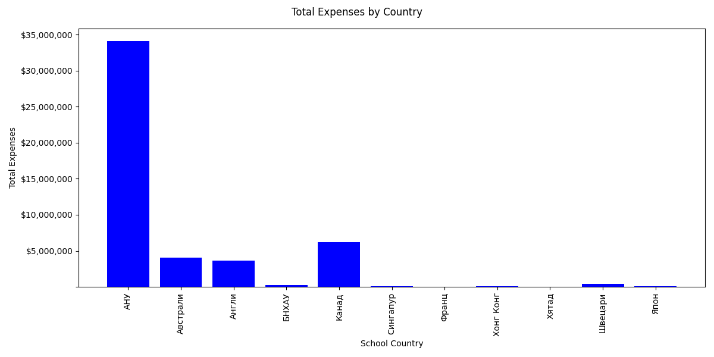

## MATRIX Testing: 

We tested with following three OSs for the following versions of python. 

    OS: 
        * Macos 
        * Ubuntu 
        * Windows

    Python: 
        * 3.7
        * 3.8 
        * 3.9
        * 3.10 
        * 3.11

## NOTE: 

This repo was cloned from a python template which has the following:
    * requirements.txt - lists out all the python libraries this program uses
    * .devcontainer folder and Dockerfile - contains config for containerization 
    * .github folder - contains CI/CD workflow instructions
        * install 
        * lint with pylint
        * format with black 
    * Makefile - contains rules for building executables

## MAIN program:

This program analyzes dataset representing the education assistant program recepients. 

Since early 2000s Mongolain government started providing tuition assistant programs to high school students who are accepted to the top 100 universities in the world. The government paid for all educational expenses including tuition, boarding etc. Per the program contract, students were expected to go back to Mongolia and work for at least 3 years after graduation.

Recently, the high percentage of people who don't follow through with the contract obligation became a huge social issue in Mongolia. In this report, we take a look the what the mean, median of the student loan amounts were as well as the standard deviation

        Mean: $117,340.00

        Median: $116,481.00

        Standard deviation: $54,692.00

On average, the mongolian government have provided $117K assistant to a student, the standard deviation being close to $55K.

Most of the students who received this education assistantship program pursued higher education in the USA, whopping $35M were spent for USA alone. The second highest country was Canada, around $7M.

